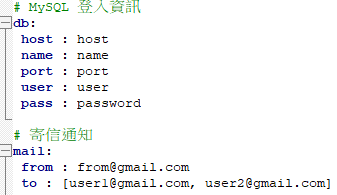
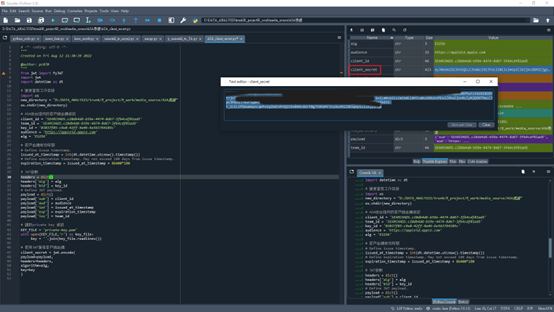
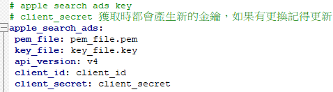
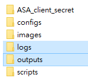
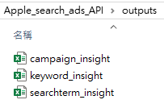
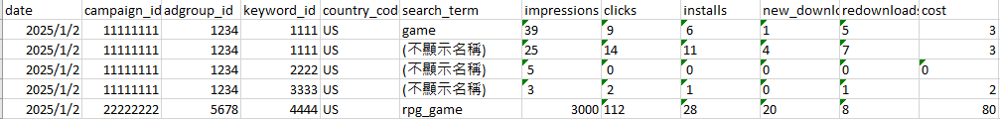

# AppleSearchAds_API
A tool for integrating with the Apple Search Ads API, enabling campaign, keyword, and search term data fetching, export to Excel, and SQL database integration with detailed logging.

### 專案簡介 | Project Overview
本專案使用 R 語言處理 Apple Search Ads API 數據，支援將 campaign、keyword、search term 資料寫入資料庫或匯出 Excel 檔案，並記錄詳細 log。
另包含 Python 程式執行 OAuth2 認證。  
This project uses R to process Apple Search Ads API data, supporting writing campaign, keyword, and search term data to a database or exporting it as Excel files, with detailed logging. 
OAuth2 authentication is managed via a Python script.

---

### 主要目的 | Main Purpose
記錄廣告投放的 campaign、keyword 和 search term 資訊，便於進行成效追蹤（如 CTR、CR、重新下載率）及數據分析（如廣告動態成本調控、受眾範圍擴展與投資報酬率 ROI 估算），以支援更精準的投放策略。  
Logs campaign, keyword, and search term data for performance tracking (e.g., CTR, CR, and re-download rates) and data analysis (e.g., dynamic cost adjustment, audience reach optimization, and ROI estimation), enabling more precise advertising strategies.

---

### 運行指導 | Usage
1. **資料庫與通知設定 Database and Notification Setup:**  
   在 all_config.yml 中填入資料庫連線資訊、通知設定以及接收信箱。  
   
2. **Apple search ads token 認證 Token Authentication:**
   開啟 ASA_client_secret 資料夾中的 Python 腳本，填入相關金鑰，執行後即可獲得最新的 client secret。  
   
3. **Apple search ads 設定 Configuration:**  
   在 ASA_config.yml 中填入 client id 和 client secret。   
   
4. **執行主程式 Run the Main Script**
   - 選擇匯出至 Excel (/scripts/export_to_xlsx) 或寫入 SQL 資料庫 (/scripts/write_to_db)。
   - 主程式包含兩部分：  
       apple_search_ads.R 處理 campaign 與 keyword 資料  
       apple_search_ads_searchterm.R 處理 search term 資料  
   - 在命令行中執行主程式，可選擇預設執行近 2 天的資料，或依需求提供開始與結束日期參數。

---

### 輸出結果 | Output Results
- `Logs` 資料夾記錄每天執行結果的文本文件  
  The Logs folder stores daily execution logs, providing detailed records of each run.  
  
- `Outputs` campaign 的詳細數據的xlsx檔案  
  The Outputs folder contains detailed Excel files for various data.  
    
keyword_insight Example:  

---

### 各檔案描述 | File Descriptions
- **ASA_client_secret.py**  
  (/ASA_client_secret)  
  用於 ASA Oauth2 認證的程式，透過填入參數，可以獲取用於 API 串接的 client secret 和 token。  
  A script for ASA Oauth2 authentication. By providing parameters, it generates a client secret and token for API integration.
- **apple_search_ads.R**  
  (/scripts/export_to_xlsx or /scripts/write_to_db)  
  用於匯出 Apple Search Ads 的廣告活動與關鍵字詳細資料，包含廣告帳號、搜尋廣告、瀏覽廣告及搜尋配對，記錄每項廣告投放指標，並將結果匯出。    
  A script for exporting detailed information on Apple Search Ads campaigns and keywords. It includes account-level, search ads, browse ads, and search match data, logging key advertising metrics and exporting the results.  
- **apple_search_ads_searchterm.R**  
  (/scripts/export_to_xlsx or /scripts/write_to_db)  
  用於匯出 Apple Search Ads 關鍵字廣告的實際搜尋字詞（search term）詳細資料，記錄每項廣告投放指標，並將結果匯出。  
  A script for exporting detailed search term data from Apple Search Ads keyword campaigns. It logs key advertising metrics for each search term and exports the results.  
